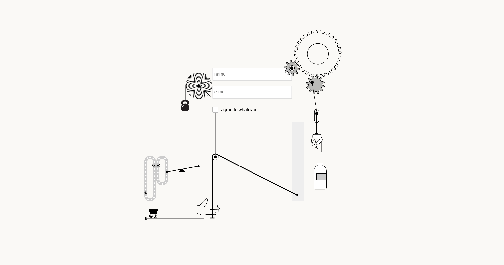
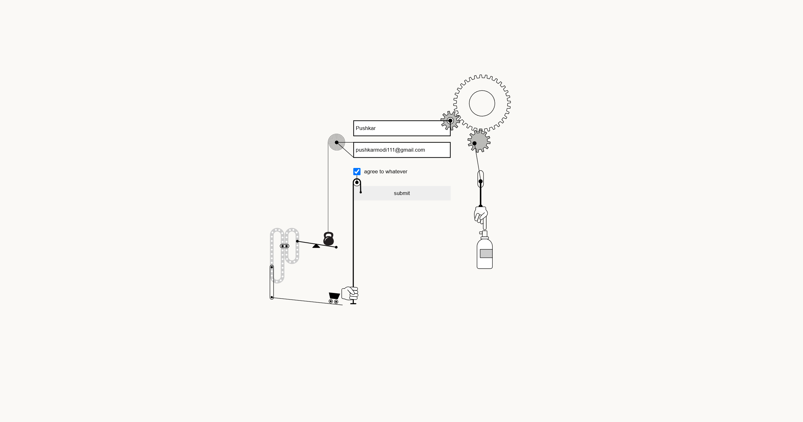

# Animated Login Form Using HTML, CSS, JS

This project is an animated login page designed to provide a visually engaging user experience. It features interactive animations that respond to user inputs, such as entering a name, email, and agreeing to terms via a checkbox. The animations include moving gears, a spraying hand, and other SVG elements that create a dynamic and playful interface.

### Key Features:
- **Interactive Form Validation** : The form fields validate user input in real-time, providing visual feedback when the input is valid.
- **Animated SVG Elements** : Various SVG elements, such as gears and a spraying hand, animate in response to user interactions.
- **Responsive Design** : The layout adjusts to fit different screen sizes, ensuring a consistent experience across devices.
## Screenshots

## Links

- Solution URL: [Github](https://github.com/Pushkar111/Login-Page-Animation)
- Live Site URL: [login-animation-form](https://login-animation-form.netlify.app/)

## My Process

### Built with

- Semantic HTML5 markup
- CSS custom properties
- Flexbox
- GSAP (GreenSock Animation Platform)
- JavaScript ES6
- Responsive design
- SVG animations
- Accessibility considerations

### Useful resources

- [MDN Web Docs](https://developer.mozilla.org) - This is an excellent resource for understanding HTML, CSS, and JavaScript concepts. It helped me a lot with SVG and animation techniques.
- [CSS-Tricks](https://css-tricks.com) - This site has numerous articles and guides on CSS techniques and best practices, which were very useful for implementing the responsive design and animations.
- [GreenSock](https://greensock.com/gsap/) - The official GSAP documentation and forums were invaluable for learning how to create complex animations and timelines.

## Author

- Website - [Pushkar Modi](https://pushkarmodidev.netlify.app)
- Github - [Pushkar111](https://github.com/Pushkar111)
